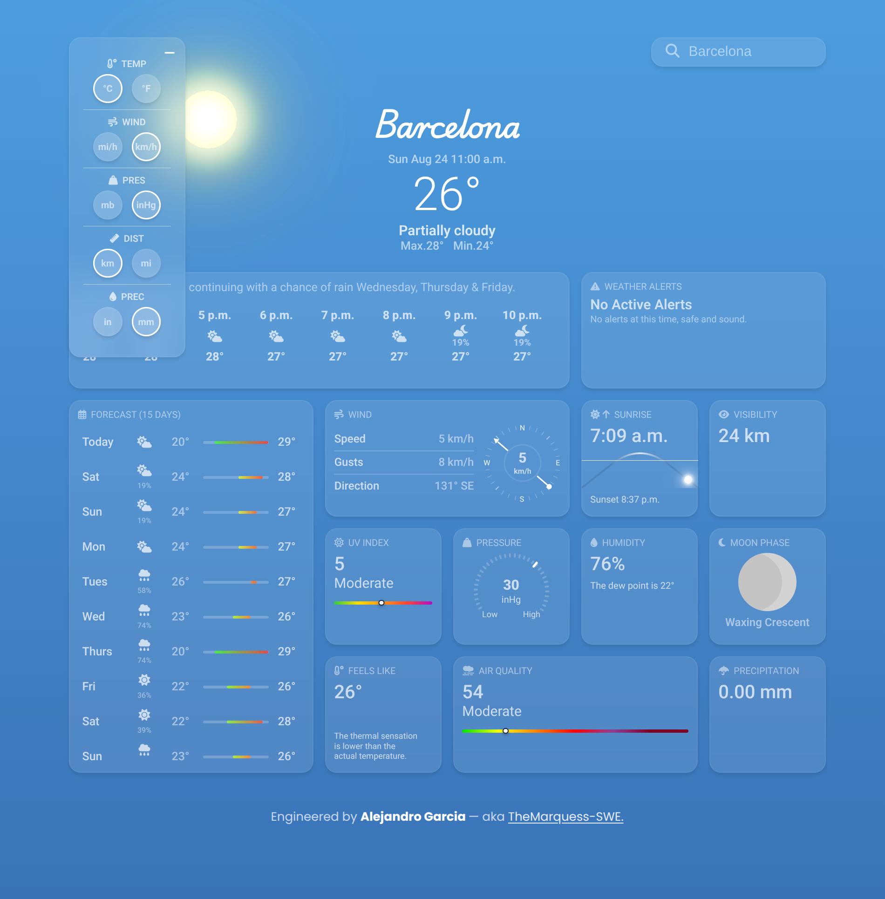
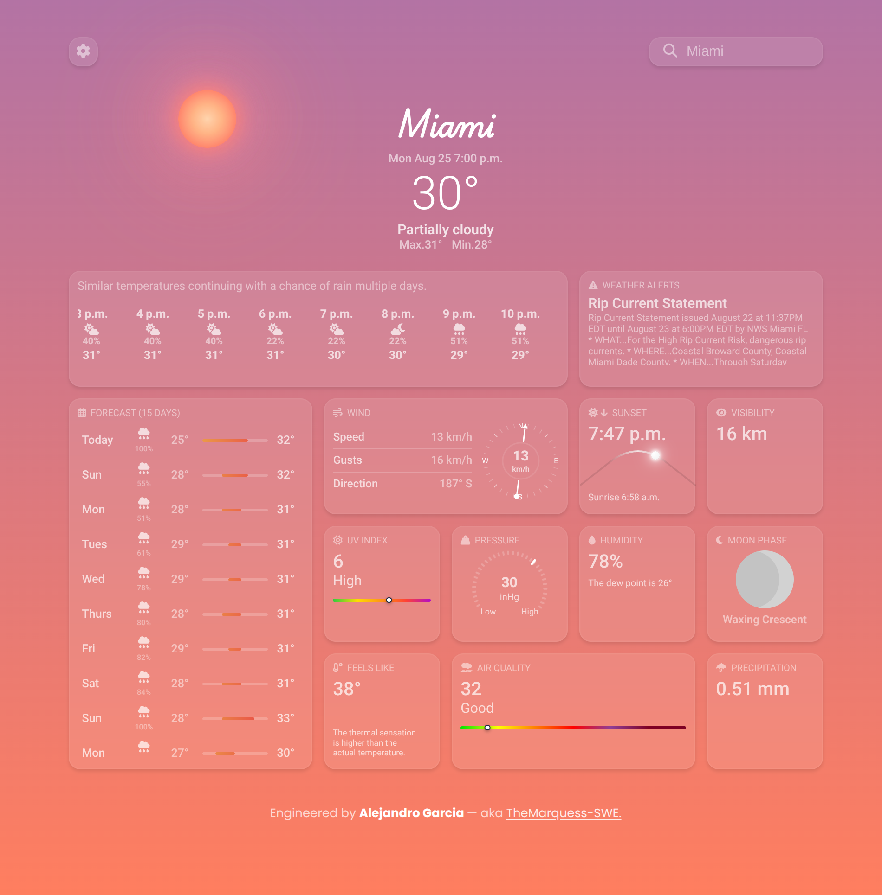
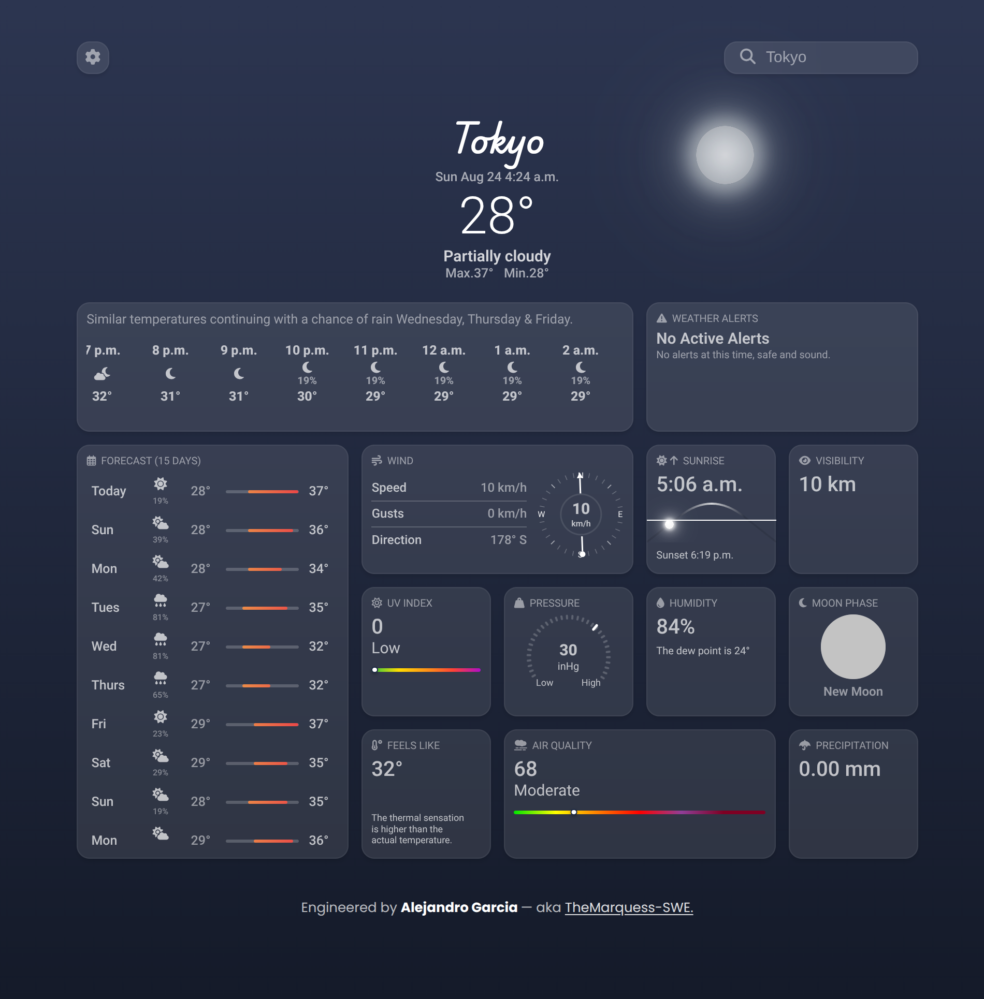

# 🌈 Weather App

A modern, modular JavaScript weather app with a clean, responsive UI. Built as part of **The Odin Project – JavaScript** course, it showcases practical use of **async/await**, API consumption (Visual Crossing + ipgeolocation), stateful unit toggles, and small reusable UI modules (sun path, wind compass, theme engine). The app changes its sky theme based on the local hour and provides current conditions plus short-term forecasts.

**Live Demo:** https://themarquess-swe.github.io/weather-app/

---

## 📸 Screenshots

  
  
  

---

## 🚀 Features

- **Search any location** for current conditions  
- **Hourly & daily forecasts** at a glance  
- **Unit toggles** for:
  - Temperature: °C ↔ °F
  - Pressure: mb ↔ inHg
  - Distance/Visibility: km ↔ mi
  - Wind speed: km/h ↔ mph
  - Precipitation: mm ↔ in
- **Auto-location** via ipgeolocation (approximate “near me” default)
- **Sun position** indicator that moves along a solar arc based on local time
- **Wind compass**: needle rotates toward the **wind bearing** (cardinal/ordinal)
- **Dynamic sky theme**: background + **Sun/Moon** visuals change with the hour of day
- Responsive, minimal UI
- Clean codebase with **ESLint (Airbnb)** + **Prettier**

---

## 🧰 Tech Stack

- **Frontend:** HTML, CSS, JavaScript (ES modules)
- **APIs:** Visual Crossing Weather API, ipgeolocation
- **Bundler:** webpack (with webpack-dev-server)
- **Code Quality:** ESLint + Prettier

---

## 🧭 Units Overview

| Category        | Options                     |
|-----------------|-----------------------------|
| Temperature     | °C ↔ °F                     |
| Pressure        | mb ↔ inHg                   |
| Distance/Visib. | km ↔ mi                     |
| Wind Speed      | km/h ↔ mph                  |
| Precipitation   | mm ↔ in                     |

---

## 🔑 API Notes

**Do not steal the free API keys come on.**
  
---

## 🧑‍💻 Author

Built by **ALEJANDRO GARCIA** — aka **TheMarquess-SWE**  
GitHub: [@TheMarquess-SWE](https://github.com/TheMarquess-SWE)
